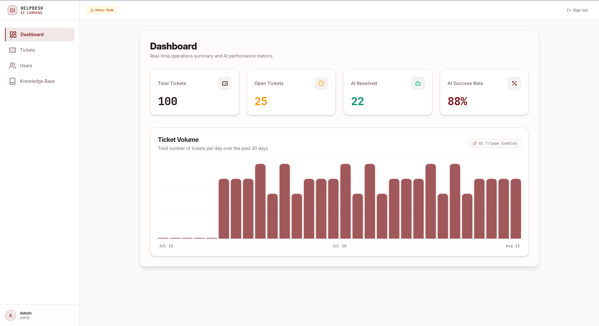
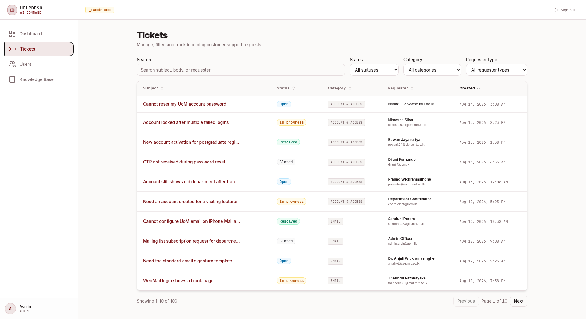
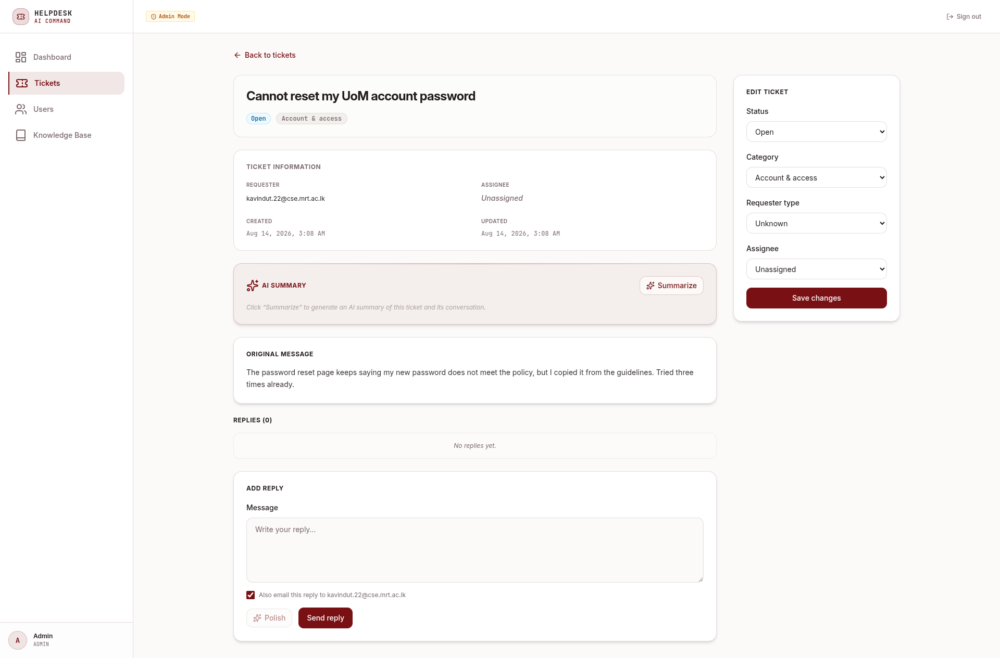
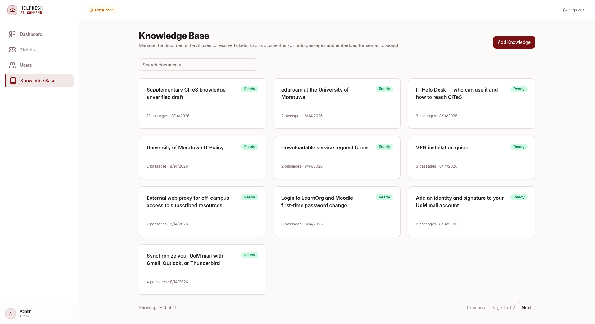
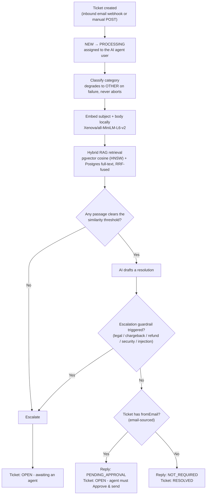
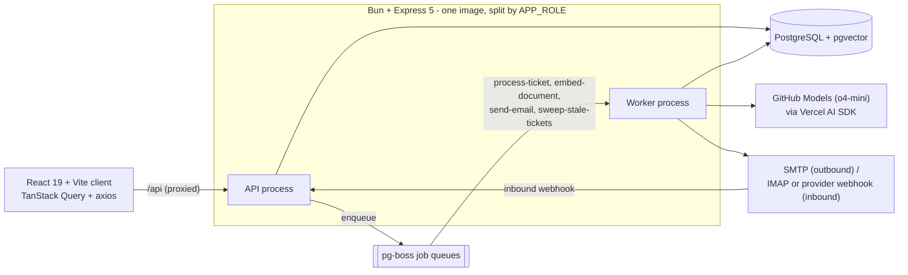

# AI-Powered Helpdesk

An AI-assisted support ticket system: tickets arrive by email or manual entry, a background
pipeline classifies them and runs retrieval-augmented generation against a knowledge base, and
either resolves them automatically or escalates to a human agent — with every AI reply on a
real customer email held for human approval before it ever sends.

Built end-to-end (app, CI/CD, containers, Kubernetes, observability) to demonstrate full-stack
and DevOps practice, not just a CRUD demo.

[](https://github.com/RumeshChathuranga/helpdesk/actions/workflows/ci.yml)
[](https://github.com/RumeshChathuranga/helpdesk/actions/workflows/build-image.yml)


## Contents

- [Screenshots](#screenshots)
- [The Inspiration](#the-inspiration)
- [Key Features](#key-features)
- [Architecture](#architecture)
- [Tech Stack](#tech-stack)
- [Getting Started](#getting-started)
- [Testing](#testing)
- [CI/CD](#cicd)
- [Docker Deployment](#docker-deployment)
- [Kubernetes Deployment](#kubernetes-deployment)
- [Observability](#observability)
- [Project Documentation](#project-documentation)

## Screenshots


| | |
| --- | --- |
| **Dashboard** — ticket volume, status/category breakdown | **Ticket list** — filter, sort, search |
|  |  |
| **Ticket detail** — AI-drafted reply awaiting approval | **Knowledge base** — document processing status |
|  |  |


## The Inspiration

This project started from a real frustration with inefficient support systems. I submitted two
identical IT help tickets on behalf of friends - one took two days to resolve, the other took
one. Despite the wildly different wait times, the final resolution and reply were exactly the
same.

That's the gap this project targets: if an issue is common enough to have a standardized reply,
there's no reason a human has to manually retype it every time. This system automates the
resolution of known issues using a knowledge base and RAG, while keeping humans in the loop for
anything novel, sensitive, or ambiguous.

## Key Features

### AI-powered pipeline

- **Automatic classification** - every incoming ticket is categorized in the background job
  pipeline, no manual triage needed. Classification failure degrades to a catch-all category
  rather than blocking the ticket.
- **Hybrid RAG** - knowledge base articles are split into overlapping, token-aware passages so
  long documents stay fully retrievable instead of being truncated at the embedding model's
  context window. Each ticket is resolved by fusing two searches - `pgvector` cosine similarity
  (HNSW-indexed) for semantic matches, and Postgres full-text search for exact terms like error
  codes - combined by Reciprocal Rank Fusion, then expanded to neighbouring passages so the AI
  sees complete context. A similarity floor gates whether the AI may attempt a resolution at
  all.
- **Guardrailed escalation** - the AI hard-escalates legal threats, chargebacks, out-of-policy
  refunds, account-security issues, and prompt-injection attempts to a human, instead of trying
  to resolve them.
- **Human-in-the-loop replies** - an AI reply on an email-sourced ticket is never sent
  automatically. It's held as a draft pending an agent's **Approve & send**.
- **Agent tools** - one-click draft polishing (grammar, tone, brand consistency) and thread
  summarization for long conversations.

### Core helpdesk

- Ticket dashboard with filtering, sorting, and status/category breakdowns.
- Role-based access control - Admins manage users and knowledge; Agents handle tickets.
- Knowledge base admin UI showing live per-document processing status
  (queued/processing/ready/failed) and passage count as the background worker chunks and embeds
  it.
- Inbound email webhook that threads replies (including replies-to-replies) onto the correct
  ticket via `In-Reply-To`/`References`, deduping repeats.
- Outbound email through a pluggable driver (SMTP in production, a no-op console logger
  everywhere else) delivered by a background job with retry and idempotent delivery.

### Platform / DevOps

- Split API and worker processes from one image (`APP_ROLE=api|worker`), so the web tier and the
  AI pipeline scale and fail independently. Both expose liveness/readiness probes and drain
  in-flight work on `SIGTERM`.
- Bun workspaces monorepo (`packages/core`) sharing Zod schemas and types across client and
  server so validation is never duplicated.
- Prometheus metrics, structured JSON logs, Grafana dashboard, and alert rules shipped as part
  of the Helm chart - see [Observability](#observability).

## Architecture

**Ticket pipeline** - the core flow, triggered on every ticket creation:



A stuck `NEW`/`PROCESSING` ticket is invisible to agents by design (the list filters those
statuses out), so the worker's top-level error handler always forces a ticket to `OPEN` before
rethrowing, and a periodic sweep catches anything that still slips through.

**System components:**



### Repo layout

```
client/          React + Vite SPA
server/          Express API + pg-boss workers, Prisma schema & migrations
packages/core/   Zod schemas + types shared by client and server ("core")
deploy/          Helm charts, Argo CD app manifests, k3d cluster config
docs/            Operational docs (knowledge base, email setup, DB indexing) + docs/planning/ (early design docs)
e2e/             Playwright end-to-end tests
jenkins/         Self-hosted Jenkins mirror of the CI pipeline
```

## Tech Stack

| Layer | Choices |
| --- | --- |
| Frontend | React 19, TypeScript, Vite, Tailwind CSS v3, shadcn/ui, React Router v7, TanStack Query |
| Backend | Bun, Express 5, TypeScript, Better Auth |
| Database | PostgreSQL + `pgvector` (HNSW cosine similarity), Prisma 7 ORM |
| Jobs | pg-boss (classification, embedding, email delivery, stale-ticket sweep) |
| AI | Vercel AI SDK, GitHub Models (`o4-mini`), Transformers.js (`Xenova/all-MiniLM-L6-v2` local embeddings) |
| Testing | Vitest + RTL (client), `bun test` (server, real integration tests against a live DB), Playwright (E2E) |
| Containers | Docker, multi-stage build, split `api`/`worker` roles from one image |
| Kubernetes | Helm charts, CloudNativePG-managed Postgres, Argo CD (GitOps), k3d for local clusters |
| CI/CD | GitHub Actions - lint/typecheck/test, Trivy scan, SPDX SBOM, keyless Cosign signing; Jenkins mirror |
| Observability | Prometheus metrics (separate port), pino structured logging, Grafana dashboard, Alertmanager rules, Loki + Grafana Alloy |

## Getting Started

### Prerequisites

- [Bun](https://bun.sh/)
- PostgreSQL with the `pgvector` extension (locally or via Docker)
- A GitHub Models token (`GITHUB_MODELS_TOKEN`)

### Installation & setup

```bash
git clone https://github.com/RumeshChathuranga/helpdesk.git
cd helpdesk
bun install
```

Copy the example env files and fill in `DATABASE_URL` and `GITHUB_MODELS_TOKEN` in `server/.env`:

```bash
cp server/.env.example server/.env
cp client/.env.example client/.env
```

Outbound email defaults to a console logger (`EMAIL_DRIVER=log`) - no extra setup needed to run
the app. To send real emails against your own inbox.

```bash
bun run db:migrate:deploy
bun run db:seed
bun run db:seed:ai
bun run dev
```

The API listens on `http://localhost:3000`; Vite serves the client on `http://localhost:5173`
and proxies `/api` to the API.

## Testing

```bash
bun run test:client   # Vitest - client component tests
bun run test:server   # bun test - real integration tests against a live test DB
bun run test:e2e      # Playwright end-to-end tests
```

Server and E2E tests run against a separate Postgres database - configure `server/.env.test`
(see `server/.env.test.example`), then run `bun run db:test:setup` once to apply migrations and
`bun run db:test:seed` to create fixture users and sample tickets.

## CI/CD

`.github/workflows/ci.yml` runs on every push and PR: lint, typecheck, client tests, server
tests against a `pgvector/pgvector:pg15` service container, and `bun audit`. On success it calls
`build-image.yml`, which builds the release image, scans it with Trivy (fails the build on
`CRITICAL`), generates an SPDX SBOM, and - on a push to `master` only - pushes to GHCR, signs the
digest with keyless Cosign, and attaches the SBOM as an attestation.

PRs build and scan but never publish, so nothing unscanned is ever pushed and nothing
unpublished is ever signed. Third-party actions are pinned by commit SHA. Published images land
at `ghcr.io/rumeshchathuranga/helpdesk`, tagged `sha-<long-sha>` plus the branch name and
`latest` on `master`.

`Jenkinsfile` mirrors the lint/typecheck/test/build stages on a self-hosted Jenkins controller
(setup in `jenkins/`) - GitHub Actions remains the real gate; Jenkins does not scan, SBOM, or
sign.

## Docker Deployment

```bash
cp .env.example .env      # at minimum, set BETTER_AUTH_SECRET - compose refuses to start without it
docker compose up --build -d
```

Four services come up: `db` (pgvector), a one-shot `migrate` job, then `api` and `worker`.
Migrations run as a separate service - deliberately, so two replicas booting together can't race
each other. The app is served on `http://localhost:3000`.

## Kubernetes Deployment

For a real cluster (or a local [k3d](https://k3d.io/) cluster - config in `deploy/k3d/`), Helm
charts live in `deploy/`. The database is a separate release so its lifecycle is independent of
the app; migrations run automatically as a Helm hook before any app pod starts.

```bash
# 1. CloudNativePG operator, then the database it manages
helm upgrade --install cnpg cnpg/cloudnative-pg -n cnpg-system --create-namespace --wait
helm upgrade --install helpdesk-db deploy/charts/helpdesk-db -n helpdesk --create-namespace \
  -f deploy/envs/dev/db-values.yaml --wait

# 2. App secrets (never templated into the chart - see deploy/charts/helpdesk/values.yaml)
kubectl create secret generic helpdesk-secrets -n helpdesk \
  --from-literal=BETTER_AUTH_SECRET="$(openssl rand -base64 32)" \
  --from-literal=GITHUB_MODELS_TOKEN=<your-token>

# 3. The app itself
helm upgrade --install helpdesk deploy/charts/helpdesk -n helpdesk \
  -f deploy/envs/dev/values.yaml --wait
```

The API and worker run as separate Deployments from the same image (`APP_ROLE`), fronted by an
Ingress, with an HPA and PodDisruptionBudget on the API and NetworkPolicies scoping each pod to
only the traffic it needs. `/api/health/live` and `/api/health/ready` back the liveness and
readiness probes, so a pod drains out of the Service instead of dropping in-flight replies.

> **Status:** the charts are `helm lint` / `helm template` clean and the k3d cluster config is
> committed, but a live end-to-end `helm install` - and a zero-dropped-requests check under load
> during a rolling restart - hasn't been run yet. Treat this section as the intended path, not a
> verified one.

## Observability

The app exports Prometheus metrics on a **separate port** (`METRICS_PORT`, default `9464`)
rather than a path on the API port, so `/metrics` is reachable from inside the cluster and
nowhere else - and the worker, which serves no API, still gets a scrape target. Logs are
structured JSON via pino.

| Metric | Question it answers |
| --- | --- |
| `helpdesk_tickets_processed_total{outcome}` | What fraction of tickets the AI resolved without a human |
| `helpdesk_pgboss_queue_depth{queue,state}` | Is the pipeline keeping up - the right autoscaling signal for the worker, where CPU isn't |
| `helpdesk_ticket_pipeline_duration_seconds` | End-to-end latency from ticket creation, queue wait included |
| `helpdesk_stale_tickets_swept_total` | Alerted on at any non-zero value - the sweeper only ever touches a ticket the primary pipeline dropped |
| `helpdesk_ai_provider_errors_total{operation}` | AI provider degradation, split by classify/resolve/summarize/polish |
| `helpdesk_rag_retrievals_total{result}` | How often the knowledge base clears the similarity floor |

The Helm chart ships a `PodMonitor`, a `PrometheusRule` with nine alerts, and the Grafana
dashboard itself as a ConfigMap, so a metric rename and the panel that draws it change in the
same commit. Prometheus, Grafana, Alertmanager, Loki and Grafana Alloy install via Argo CD from
`deploy/argocd/apps/`. CI renders the Helm chart for every environment overlay and runs
`promtool check rules` over the resulting alert expressions, so a typo'd PromQL query fails the
build instead of silently never firing.
